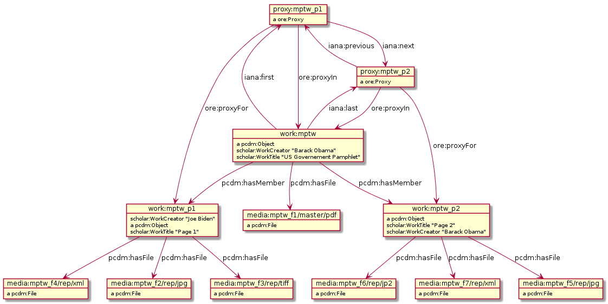

# rdfgraph
**rdfgraph** is a tool written in Python 2.7, which can create RDF graph
images from input in **rdfxml/ntriples/turtle/rss-tag-soup** format
using [Redland's librdf] and [PlantUML].

Because librdf is currently not available on Windows, this tool won't work
on Windows unless you port librdf to Windows.

Example:
- as input I used Vladimir Alexiev's [PCDM_Multi_Page_Text.ttl] from
  [Diagrams with rdfpuml]
- usage:
  ```  
  $ rdfgraph.py PCDM_Multi_Page_Text.ttl > PCDM_Multi_Page_Text.puml  
  Read ./defns.json (47 namespaces)  
  Parsing file PCDM_Multi_Page_Text.ttl as turtle  
  Found 35 statements  
  $ plantuml PCDM_Multi_Page_Text.puml  
  ```
- this creates the following picture ([PCDM_Multi_Page_Text.png]):  
  

## Usage

```
usage: rdfgraph.py [-h] [-d] [-f FORMAT] [-l LANG] [-t] [-s] [-m MAX_COUNT]
                   file.rdf [file.rdf ...]

Creates PlantUML file from RDF file(s)

positional arguments:
  file.rdf      RDF file(s) to process

optional arguments:
  -h, --help    show this help message and exit
  -d            Print debug info (default: False)
  -f FORMAT     Input FORMAT: rdfxml, ntriples, turtle or rss-tag-soup
                (default: None)
  -l LANG       Literal LANGUAGE: en, en-us, de, fr, ... (default: None)
  -t            Display literal type (default: False)
  -s            Shorten literals (to max. 160 chars) (default: False)
  -m MAX_COUNT  Read max. MAX_COUNT input statements (default: None)
```
If there is a file [defns.json] present in the same directory where
rdfgraph.py resides, rdfgraph will use this file for the definition of
namespaces instead of the built-in ones.

## Limitations
Supported input formats are dependend on librdf, currently:
- rdfxml (.rdf or .owl)
- ntriples (.nt)
- turtle (.ttl)
- rss-tagg-soup (.rss)

and are recognized by the file extension, if not specified otherwise.

When processing very large RDF files, you can hit the limit of how many
statements you can read in the memory. This depends on the way librdf is
used via Python bindings (it doesn't exist if you use librdf natively).

For very large/complex RDF files I suggest setting the environment variable
**PLANTUML_LIMIT_SIZE** to something like 100000 (pixels) or more and setting
the **-Xmx** to several GBs, before running plantuml.

[Redland's librdf]: http://librdf.org
[PlantUML]: http://plantuml.com
[PCDM_Multi_Page_Text.ttl]: https://github.com/mrihtar/rdfgraph/blob/master/sample/PCDM_Multi_Page_Text.ttl
[Diagrams with rdfpuml]: https://github.com/duraspace/pcdm/wiki/Diagrams-with-rdfpuml
[PCDM_Multi_Page_Text.png]: https://github.com/mrihtar/rdfgraph/blob/master/sample/PCDM_Multi_Page_Text.png
[defns.json]: https://github.com/mrihtar/rdfgraph/blob/master/defns.json
